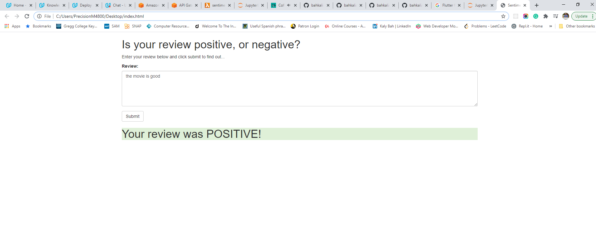
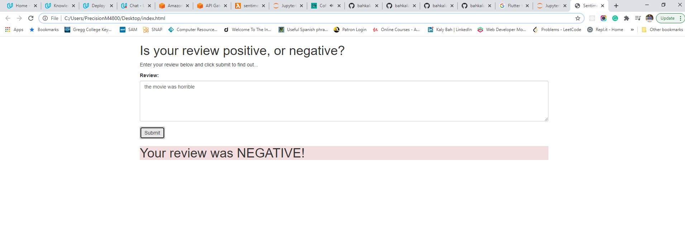

# SageMaker Deployment Project

The notebook and Python files provided here, once completed, result in a simple web app which interacts with a deployed recurrent neural network performing sentiment analysis on movie reviews. This project use assumes some familiarity with SageMaker Sentiment Analysis using Pytorch, should provide enough background.

- Download or otherwise retrieve the data.
- Process / Prepare the data.
- Upload the processed data to S3.
- Train a chosen model.
- Test the trained model (typically using a batch transform job).
- Deploy the trained model.
- Use the deployed model.

## Usage

SageMaker Deployment process

Using the positive reviews

Using the negative review

## Installation

Please see the [README](https://github.com/udacity/sagemaker-deployment/tree/master/README.md) in the root directory for instructions on setting up a SageMaker notebook and downloading the project files (as well as the other notebooks).

## Issue 

I had to upload the index.html in order to work

## License 
 
[MIT License](LICENSE)